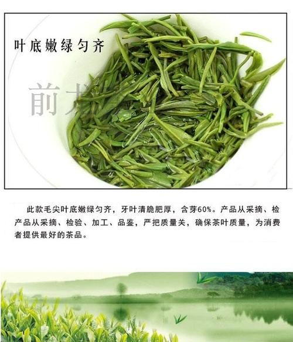

# [自我介绍](https://github.com/flechazo-garcia/blog-test/blob/master/README.md)
我是Flechazo，来自于宜兴，宜兴四大特点：
* 陶的古都
* 洞的世界
* 茶的绿洲
* 竹的海洋


爱好：
1. 绘画
2. 养多肉
3. rua蜜袋鼯


学过java

```java
public static void main(String[] args){
    System.out.println(LocalDate.now());
}
```